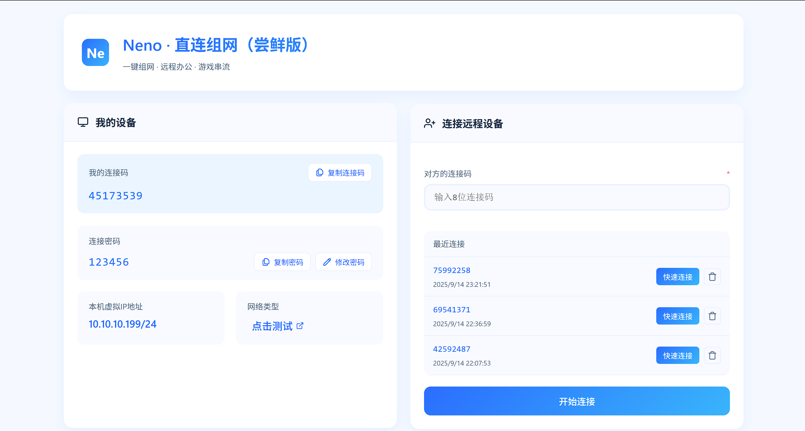
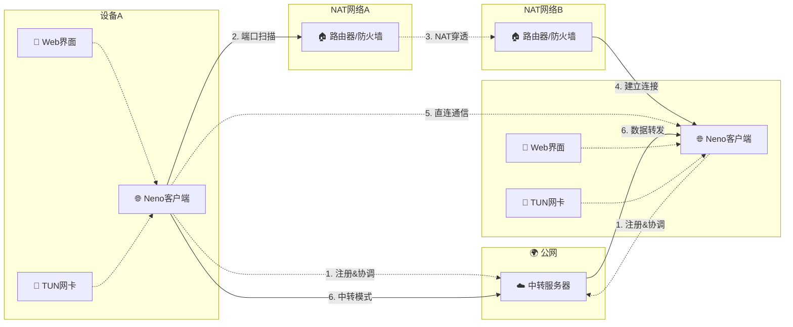
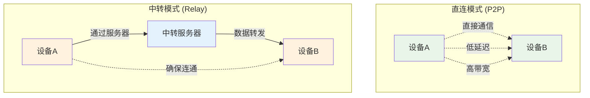

# 🌐 Neno - 史上最自由的NAT穿透组网工具

<div align="center">


**基于TUN设备的智能NAT穿透解决方案，让远程设备轻松建立虚拟局域网**

[](https://golang.org/)
[](LICENSE)
[](https://github.com/venshao/natun)
[](https://github.com/venshao/natun)

[🚀 立即下载](#-立即下载) • [📖 快速使用](#-快速使用) • [💡 功能特性](#-功能特性) • [🛠️ 技术架构](#️-技术架构) • [⚙️ 配置说明](#️-配置说明)

</div>

---

## ✨ 项目简介

Neno 是一个基于 Go 语言开发的高性能 NAT 穿透组网工具，通过 TUN 虚拟网卡技术，让分布在不同网络环境中的设备能够建立虚拟局域网连接。无论是家庭办公、远程开发、游戏串流还是内网穿透，Neno 都能为您提供稳定、高效的网络连接解决方案。

> 💡 **欢迎加入技术交流群**：我们为NAT穿透技术爱好者准备了QQ群和微信群，一起讨论技术、分享经验、共建开源社区！[点击查看群二维码](#-联系我们)

<div align="center">



*Neno 现代化Web管理界面 - 直观易用的设备连接管理*

</div>

### 🎯 核心优势

- **🔧 高效NAT穿透**：并发端口扫描 + 随机化策略，穿透成功率高
- **⚡ 双模式连接**：直连模式（P2P）优先，中转模式自动回退
- **🏢 私有部署支持**：支持自建中转服务器，满足企业级需求
- **🌍 跨平台支持**：Windows、Android、Linux、macOS 全平台兼容
- **🎨 现代Web界面**：基于 Vue.js 的直观管理界面
- **📊 实时监控**：连接状态、延迟监控、流量统计一目了然

---

## 🚀 立即下载

### 📥 下载方式

#### 方式一：Gitee Releases（推荐）
windows系统：https://gitee.com/qwxrepo/natun/releases/download/v0.0.1-alpha/cli-windows-x64.zip

Android系统：https://gitee.com/qwxrepo/natun-android/releases/download/v0.0.1-alpha/neno-android.apk

Linux系统：https://gitee.com/qwxrepo/natun/releases/download/v0.0.1-alpha/cli-linux-x64

Mac系统：https://gitee.com/qwxrepo/natun/releases/download/v0.0.1-alpha/cli-mac-x64

#### 方式二：从源码编译
```bash
# 克隆仓库
git clone https://gitee.com/qwxrepo/natun.git
cd natun

# 编译客户端
cd udpclient
./build.sh  # Linux/macOS
# 或 build.bat  # Windows

# 编译服务器（可选）
cd ../udpcloud
./build.sh  # Linux/macOS
# 或 build.bat  # Windows
```

### 📋 系统要求

| 平台          | 要求                                    |
|-------------|---------------------------------------|
| **Windows** | Windows 10/11 (需要管理员权限)               |
| **Android** | Android 7.0+                          |
| **Linux**   | Ubuntu 18.04+ / CentOS 7+ / Debian 9+ |
| **macOS**   | macOS 10.14+                          |

---

## 📖 快速使用

### 🎮 三步上手

#### 1️⃣ 启动程序
```bash
# Windows (需要管理员权限)
双击打开 cli-windows-x64.exe

# Android
安装 neno-android.apk 并启动

# Linux (需要root权限)
sudo ./cli-linux-x64

# macOS (需要root权限)
sudo ./cli-mac-x64
```

#### 2️⃣ 访问界面
- PC端程序启动后会自动打开浏览器
- PC端访问地址：`http://127.0.0.1:8898`
- 在"我的设备"中查看您的连接码和密码

#### 3️⃣ 建立连接
- 在"连接远程设备"中输入对方的连接码
- 输入对方的连接密码
- 点击"开始连接"

### 🎯 使用场景

| 场景 | 说明 | 优势 |
|------|------|------|
| **🏠 家庭办公** | 远程访问家中电脑 | 安全、稳定、零配置 |
| **💼 企业应用** | 分支机构网络互通 | 支持私有部署、企业级安全 |
| **🎮 游戏娱乐** | 游戏串流、多人游戏 | 低延迟、高带宽 |
| **🔧 技术开发** | 内网穿透、测试环境 | 简单易用、功能强大 |

---

## 💡 功能特性

### 🔧 NAT穿透技术

- **并发端口扫描**：基于配置的端口范围进行并发扫描
- **随机化策略**：随机打乱端口顺序，避免固定模式被检测
- **多轮重试**：最多3轮扫描，每轮间隔1秒
- **并发控制**：可配置最大并发数，避免网络拥塞
- **智能回退**：扫描失败自动切换到中转模式
- **全NAT类型支持**：NAT1、NAT2、NAT3、NAT4全覆盖

### 🌐 双模式连接

#### 直连模式 (P2P)
- **零延迟转发**：设备间直接通信，无服务器中转
- **高带宽利用**：充分利用设备间网络带宽
- **低服务器负载**：减少服务器资源消耗

#### 中转模式 (Relay)
- **自动回退**：直连失败时自动切换到中转模式
- **高可用性**：确保连接始终可用
- **私有部署**：支持自建中转服务器，数据完全可控
- **企业级应用**：满足内网隔离、安全合规等企业需求
- **智能负载均衡**：服务器端智能分发

### 🎨 现代化界面

- **响应式设计**：支持桌面端和移动端访问
- **实时状态监控**：连接状态、延迟、流量实时显示
- **设备管理**：最近连接设备快速重连
- **密码管理**：支持动态修改连接密码

<div align="center">


*直观的Web管理界面，让网络连接变得简单易用*

</div>

### 🔒 安全特性

- **密码验证**：6位数字密码保护连接安全
- **访问控制**：基于客户端ID的身份验证
- **会话管理**：自动清理过期连接

---

## 📱 使用指南

### 🖥️ Web界面操作

#### 查看设备信息
- **连接码**：8位数字，用于标识您的设备
- **连接密码**：6位数字，用于验证连接权限
- **虚拟IP**：TUN设备分配的IP地址
- **网络类型**：显示当前NAT类型

#### 建立连接
1. 输入对方的8位连接码
2. 点击"开始连接"按钮
3. 在弹出的对话框中输入对方密码
4. 等待连接建立

#### 连接状态监控
- **连接模式**：显示当前连接方式（直连/中转）
- **远程设备信息**：显示对方设备ID和虚拟IP
- **延迟监控**：实时显示网络延迟
- **连接状态**：显示连接是否正常

### 🔧 常见问题

#### 连接失败
- 检查网络连接是否正常
- 确认防火墙设置
- 验证对方连接码和密码是否正确

#### 权限问题
- Windows：确保以管理员身份运行
- Linux/macOS：确保有root权限

#### 端口被占用
- 检查8898端口是否被其他程序占用
- 重启程序或修改端口配置

---

## 🛠️ 技术架构

### 📊 系统架构图



**连接流程说明：**
1. **注册协调**：双方客户端向服务器注册，获取对方信息
2. **端口扫描**：客户端A开始扫描客户端B的可能端口
3. **NAT穿透**：通过UDP打洞技术建立直连通道
4. **建立连接**：成功穿透后建立P2P连接
5. **直连通信**：数据通过直连通道传输（优先模式）
6. **中转模式**：直连失败时通过服务器转发数据

### 🔄 连接模式对比



**模式特点对比：**

| 特性 | 直连模式 | 中转模式 |
|------|----------|----------|
| **延迟** | 5-50ms | 50-200ms |
| **带宽** | 设备间最大带宽 | 服务器带宽限制 |
| **稳定性** | 依赖网络环境 | 高稳定性 |
| **服务器负载** | 无 | 需要服务器资源 |
| **适用场景** | 网络环境良好 | 网络环境复杂 |

### 🔧 核心组件

#### 客户端组件 (`udpclient/`)

| 组件 | 功能描述 |
|------|----------|
| `main.go` | 主程序入口，NAT穿透核心逻辑（并发端口扫描） |
| `client_framework.go` | UDP客户端框架，消息路由处理 |
| `connection_mode.go` | 连接模式管理（直连/中转/断开） |
| `net_device.go` | 网络设备抽象接口 |
| `tun_*.go` | 平台特定TUN设备实现 |
| `web_controller.go` | Web API控制器 |
| `config.go` | 配置管理模块（端口范围、并发数等） |

#### 服务器组件 (`udpcloud/`)

| 组件 | 功能描述 |
|------|----------|
| `main.go` | 服务器主程序 |
| `server_framework.go` | UDP服务器框架 |
| `relay.go` | 中转服务实现 |

### 📡 通信协议

#### 控制消息协议
```json
{
  "path": "ping|pong|connectPeer|beat|beatAck",
  "clientId": "客户端ID",
  "timestamp": "时间戳",
  "data": "具体数据"
}
```

#### 数据传输协议
```
[魔数4B] + [模式1B] + [数据长度2B] + [TUN数据]
```

- **魔数**: `0x12 0x34 0x56 0x78`
- **模式**: `0x01`(直连) / `0x02`(中转)
- **数据长度**: 2字节大端序
- **TUN数据**: 原始IP数据包

#### NAT穿透流程
1. **端口更换**：双方同时更换本地端口
2. **端口扫描**：基于配置范围并发扫描目标端口
3. **随机化**：随机打乱端口顺序，避免检测
4. **多轮重试**：最多3轮扫描，每轮间隔1秒
5. **成功检测**：收到心跳响应即建立直连
6. **自动回退**：超时后自动切换到中转模式

---

## 📱 使用指南

### 🖥️ Web界面操作

#### 1. 查看设备信息
- **连接码**：8位数字，用于标识您的设备
- **连接密码**：6位数字，用于验证连接权限
- **虚拟IP**：TUN设备分配的IP地址
- **网络类型**：显示当前NAT类型

#### 2. 建立连接
1. 输入对方的8位连接码
2. 点击"开始连接"按钮
3. 在弹出的对话框中输入对方密码
4. 等待连接建立

#### 3. 连接状态监控
- **连接模式**：显示当前连接方式（直连/中转）
- **远程设备信息**：显示对方设备ID和虚拟IP
- **延迟监控**：实时显示网络延迟
- **连接状态**：显示连接是否正常

### 🔧 命令行操作

#### 配置文件管理
```bash
# 查看当前配置
cat config.json

# 修改配置后重启生效
./cli
```

#### 日志查看
```bash
# 设置日志级别
# DEBUG: 详细调试信息
# INFO: 一般信息
# WARN: 警告信息
# ERROR: 错误信息
```

---

## ⚙️ 配置说明

### 📄 配置文件结构

```json
{
  "punch_hole": {
    "max_concurrency": 2,          // 打洞最大并发数
    "port_range": 16,              // 打洞端口范围
    "base_port_offset": 0,         // 基础端口偏移量
    "enable_relay": true,          // 是否启用中转模式
    "punch_timeout": 20,           // 打洞超时时间（秒）
    "relay_fallback": true         // 打洞失败后自动切换到中转
  },
  "server": {
    "host": "117.72.206.26",      // 中转服务器IP地址
    "port": 17709                 // 中转服务器端口
  },
  "log_level": "INFO",             // 日志级别
  "tun_ip": "10.10.10.199",        // TUN设备IP地址
  "client_id": "45173539",          // 客户端唯一标识
  "client_pwd": "123456"           // 客户端密码
}
```

### 🎛️ 参数调优

#### 高性能配置
```json
{
  "punch_hole": {
    "max_concurrency": 10,
    "port_range": 50,
    "punch_timeout": 15
  },
  "log_level": "WARN"
}
```

#### 低延迟配置
```json
{
  "punch_hole": {
    "enable_relay": false,
    "relay_fallback": false,
    "punch_timeout": 30
  }
}
```

#### 私有服务器配置
```json
{
  "punch_hole": {
    "max_concurrency": 5,
    "port_range": 32,
    "punch_timeout": 15
  },
  "server": {
    "host": "your-server-ip",
    "port": 17709
  },
  "log_level": "INFO"
}
```

---

## 🏢 私有服务器部署

Neno 支持自建中转服务器，满足企业级私有部署需求。

### 🚀 快速部署

#### 1. 编译服务器程序
```bash
# 进入服务器目录
cd udpcloud

# 使用构建脚本编译
./build.sh  # Linux/macOS
# 或 build.bat  # Windows

# 选择编译目标平台
# 1. Windows版本
# 2. Linux版本  
# 3. macOS版本
```

#### 2. 部署服务器
```bash
# Linux/macOS
sudo ./bin/linux/server

# Windows
bin\windows\server.exe
```

#### 3. 配置客户端
```json
{
  "server": {
    "host": "your-server-ip",
    "port": 17709
  }
}
```

### 🔧 服务器配置

服务器默认监听端口 `17709`，支持以下功能：
- **客户端注册**：管理客户端连接状态
- **NAT穿透协调**：协调双方打洞过程
- **中转服务**：直连失败时提供数据转发
- **会话管理**：自动清理离线客户端

### 📊 企业级特性

- **高可用性**：支持多服务器负载均衡
- **安全隔离**：数据不经过第三方服务器
- **监控告警**：支持连接状态监控
- **日志审计**：完整的连接日志记录

---

## 🌟 应用场景

### 🏠 家庭办公
- **远程桌面**：安全访问家中电脑
- **文件共享**：跨设备文件同步
- **内网服务**：访问家中NAS、路由器等

### 💼 企业应用
- **分支机构互联**：多办公地点网络互通
- **远程开发**：安全访问开发环境
- **监控系统**：远程监控设备管理
- **私有云部署**：自建中转服务器，数据完全可控

### 🎮 游戏娱乐
- **游戏串流**：低延迟游戏串流
- **多人游戏**：建立游戏专用网络
- **媒体共享**：家庭媒体中心访问

### 🔧 技术开发
- **内网穿透**：本地服务公网访问
- **测试环境**：多环境网络互通
- **容器网络**：跨主机容器通信

---

## 🚀 性能优化

### 📊 性能指标

| 指标 | 直连模式 | 中转模式 |
|------|----------|----------|
| **延迟** | 5-50ms | 50-200ms |
| **带宽** | 设备间最大带宽 | 服务器带宽限制 |
| **CPU使用** | < 5% | < 10% |
| **内存使用** | < 50MB | < 100MB |

### ⚡ 优化建议

#### 网络优化
- 使用有线网络连接
- 关闭不必要的网络服务
- 优化路由器QoS设置

#### 系统优化
- 关闭防火墙或添加例外规则
- 使用SSD存储提高IO性能
- 确保系统时间同步

#### 配置优化
- 根据网络环境调整并发数
- 合理设置端口范围
- 启用中转模式作为备选方案

---

## 🔧 故障排除

### ❌ 常见问题

#### 连接失败
```bash
# 检查网络连接
ping 8.8.8.8

# 检查防火墙设置
# Windows: 关闭Windows防火墙或添加例外
# Linux: sudo ufw disable
# macOS: 系统偏好设置 -> 安全性与隐私 -> 防火墙

# 检查NAT类型
# 访问 https://www.checkmynat.com 测试NAT类型
```

#### TUN设备创建失败
```bash
# Windows: 确保以管理员身份运行
# Linux: 确保有root权限
sudo ./cli

# macOS: 确保有管理员权限
sudo ./cli
```

#### 端口被占用
```bash
# 检查端口占用
netstat -an | grep 8898

# 修改Web服务端口（需要修改源码）
# 在 web_controller.go 中修改端口号
```

### 📋 调试步骤

1. **启用调试日志**
   ```json
   {
     "log_level": "DEBUG"
   }
   ```

2. **检查配置文件**
   ```bash
   cat config.json
   ```

3. **查看系统日志**
   ```bash
   # Windows: 事件查看器
   # Linux: journalctl -f
   # macOS: Console.app
   ```

4. **网络诊断**
   ```bash
   # 检查UDP连通性
   nc -u -v 117.72.206.26 17709
   
   # 检查TUN设备
   ip addr show
   ```

---

## 🤝 贡献指南

我们欢迎所有形式的贡献！无论是代码、文档、问题报告还是功能建议。

### 🛠️ 开发环境搭建

```bash
# 1. 克隆仓库
git clone https://gitee.com/qwxrepo/natun.git
cd natun

# 2. 安装依赖
go mod download

# 如果网络超时，请设置代理再重新安装依赖
go env -w GO111MODULE=on
go env -w GOPROXY=https://mirrors.aliyun.com/goproxy/,direct
go mod download

# 3. 构建项目
cd udpclient && (./build.sh || build.bat)
cd ../udpcloud && (./build.sh || build.bat)
```

### 📝 提交规范

- **feat**: 新功能
- **fix**: 修复bug
- **docs**: 文档更新
- **style**: 代码格式调整
- **refactor**: 代码重构
- **test**: 测试相关
- **chore**: 构建过程或辅助工具的变动

### 🐛 问题报告

在提交问题前，请确保：
1. 搜索现有问题避免重复
2. 提供详细的错误信息
3. 包含系统环境信息
4. 提供复现步骤

---

## 📄 许可证

本项目采用 [MIT License](LICENSE) 许可证。

```
MIT License

Copyright (c) 2024 Neno Team

Permission is hereby granted, free of charge, to any person obtaining a copy
of this software and associated documentation files (the "Software"), to deal
in the Software without restriction, including without limitation the rights
to use, copy, modify, merge, publish, distribute, sublicense, and/or sell
copies of the Software, and to permit persons to whom the Software is
furnished to do so, subject to the following conditions:

The above copyright notice and this permission notice shall be included in all
copies or substantial portions of the Software.

THE SOFTWARE IS PROVIDED "AS IS", WITHOUT WARRANTY OF ANY KIND, EXPRESS OR
IMPLIED, INCLUDING BUT NOT LIMITED TO THE WARRANTIES OF MERCHANTABILITY,
FITNESS FOR A PARTICULAR PURPOSE AND NONINFRINGEMENT. IN NO EVENT SHALL THE
AUTHORS OR COPYRIGHT HOLDERS BE LIABLE FOR ANY CLAIM, DAMAGES OR OTHER
LIABILITY, WHETHER IN AN ACTION OF CONTRACT, TORT OR OTHERWISE, ARISING FROM,
OUT OF OR IN CONNECTION WITH THE SOFTWARE OR THE USE OR OTHER DEALINGS IN THE
SOFTWARE.
```

---

## 🙏 致谢

感谢以下开源项目的支持：

- [Go](https://golang.org/) - 编程语言
- [Vue.js](https://vuejs.org/) - 前端框架
- [Wintun](https://www.wintun.net/) - Windows TUN驱动
- [Water](https://github.com/songgao/water) - Go TUN/TAP库

---

## 📞 联系我们

- **Gitee Issues**: [提交问题](https://gitee.com/qwxrepo/natun/issues)
- **Email**: [联系我们](mailto:jvenshao@gmail.com)

### 💬 加入讨论群

欢迎加入我们的技术交流群，一起讨论NAT穿透技术、分享使用经验、共建开源社区！

<div align="center">

| QQ群 | 微信群 |
|------|--------|
|  |  |
| **QQ技术交流群** | **微信技术交流群** |
| 扫码加入QQ群讨论 | 扫码加入微信群讨论 |

</div>

**群内讨论内容：**
- 🔧 NAT穿透技术交流
- 🐛 问题反馈与解决
- 💡 功能建议与改进
- 🚀 开源社区共建
- 📚 使用经验分享

---

<div align="center">

**⭐ 如果这个项目对您有帮助，请给我们一个Star！**

Made with ❤️ by [Neno Team](https://github.com/venshao/natun)

</div>